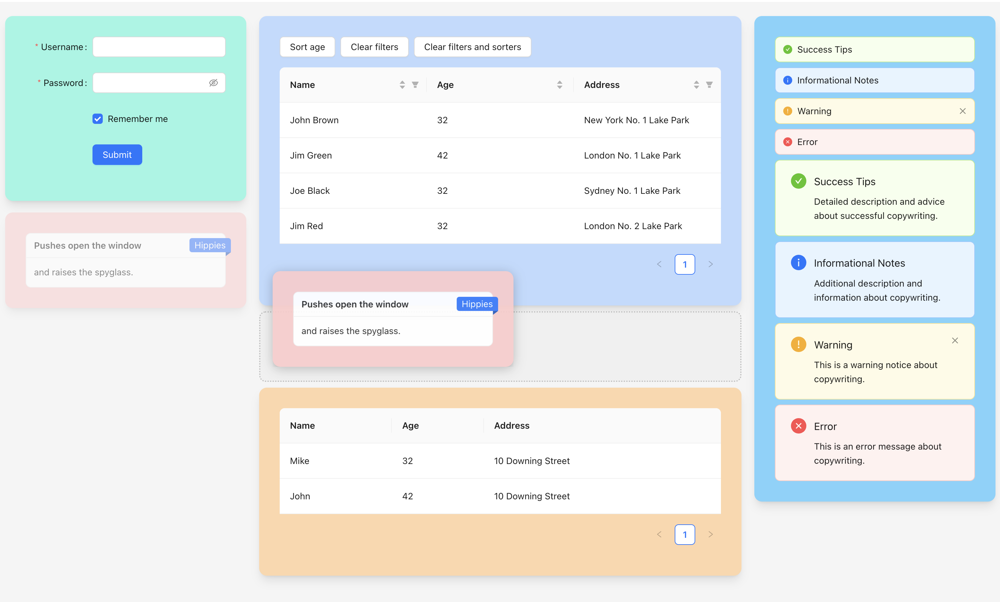

# react-draggable-layout

Put your React.js components into a draggable column layout.



## Pages

- [npm](https://www.npmjs.com/package/react-draggable-layout)
- [github](https://github.com/dsocha/react-draggable-layout)

## Install

```bash
yarn add react-draggable-layout
```

```bash
npm install --save react-draggable-layout
```

## Usage

```jsx
import DraggableLayout from 'react-draggable-layout';

const App = () => {
  return (
    const components = [
      { col: 0, id: 'Component 1', component: <div style={{ height: '120px', backgroundColor: 'rgb(125 211 252)', borderRadius: '1rem', padding: '24px', boxShadow: '0 8px 10px -4px #cccccc' }}>Component #1</div> },
      { col: 0, id: 'Component 2', component: <div style={{ height: '180px', backgroundColor: 'rgb(153 246 228)', borderRadius: '1rem', padding: '24px', boxShadow: '0 8px 10px -4px #cccccc' }}>Component #2</div> },
      { col: 1, id: 'Component 3', component: <div style={{ height: '300px', backgroundColor: 'rgb(254 202 202)', borderRadius: '1rem', padding: '24px', boxShadow: '0 8px 10px -4px #cccccc' }}>Component #3</div> },
      { col: 1, id: 'Component 4', component: <div style={{ height: '250px', backgroundColor: 'rgb(191 219 254)', borderRadius: '1rem', padding: '24px', boxShadow: '0 8px 10px -4px #cccccc' }}>Component #4</div> },
      { col: 2, id: 'Component 5', component: <div style={{ height: '180px', backgroundColor: 'rgb(254 215 170)', borderRadius: '1rem', padding: '24px', boxShadow: '0 8px 10px -4px #cccccc' }}>Component #5</div> },
    ];

    const handleOnChange = (c) => {
      console.log('onChange()', c);
    }

    <div style={{ height: '100vh' }}>
      <DraggableLayout components={components} onChange={handleOnChange} columns={3} mainColumnIndex={1} draggable={true} />
    </div>
  );
}

export default App;
```

## Properties

- **components**
  - An array of components that you want to place into DraggableLayout. Each object must contain following props:
    - **id** - a unique id
    - **col** - an index of column where you want to place your component
    - **component** - a component you want to place
- **onChange**
  - An event that is fired when a user draggs component to another place.
- **columns**
  - Number of columns in the layout.
- **mainColumnIndex**
  - Index of the main column. The main column is wider than others.
- **draggable**
  - Set false if you want to disable drag and drop.
